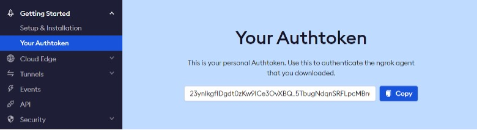
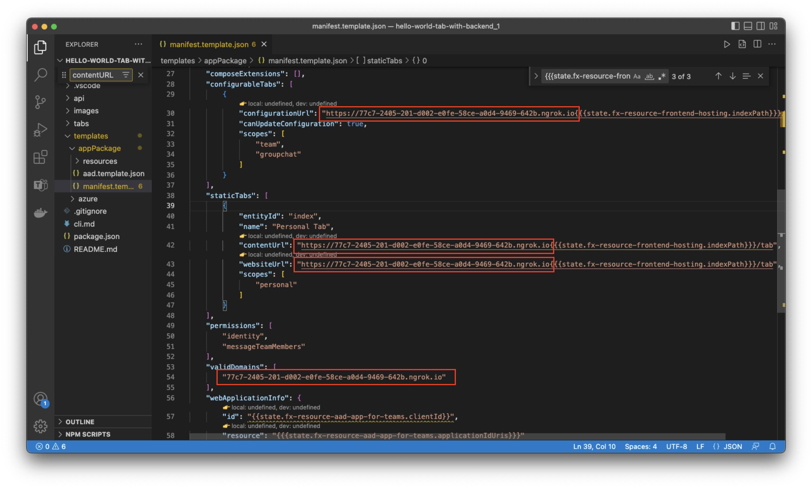
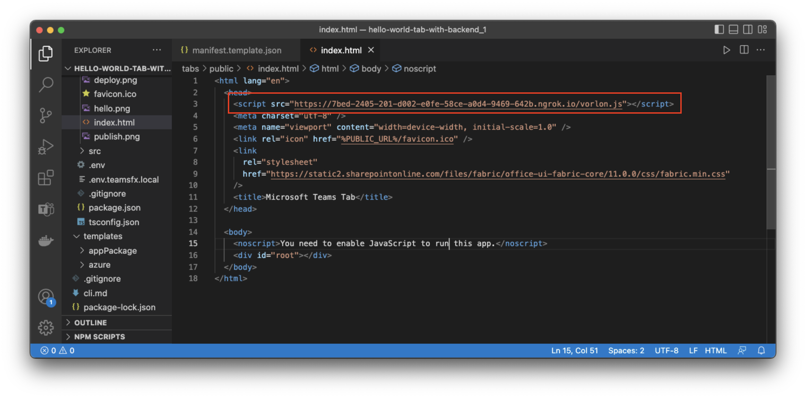
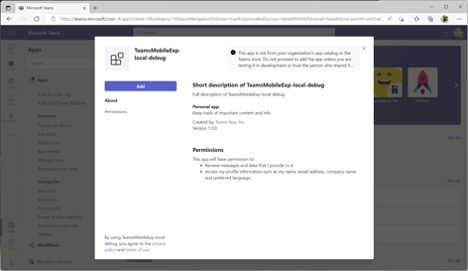
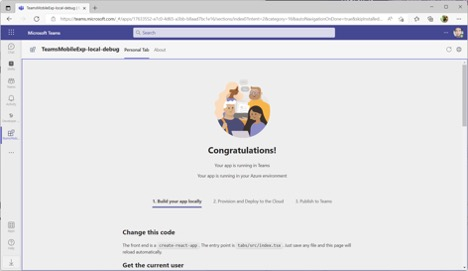
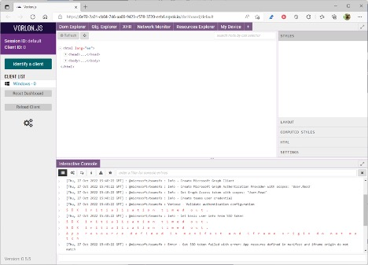
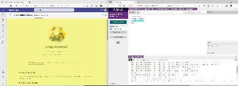
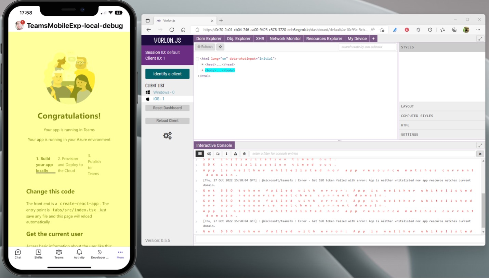
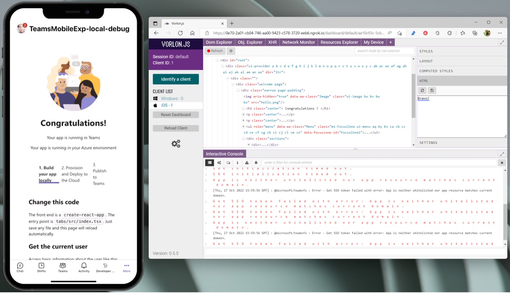
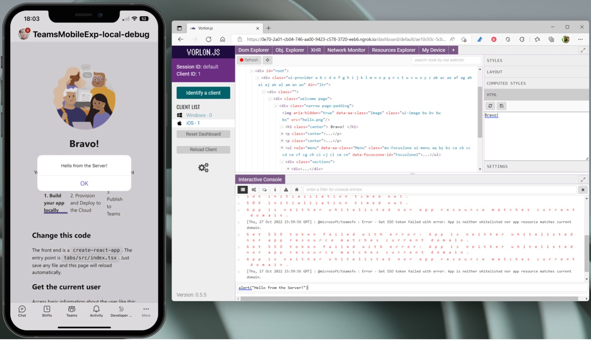

# Teams App Mobile debugging tool setup guide

> Document version: 1.0.0
> Document last updated: March 22 2023 11:55:44 IST

## Introduction

This guide will help you setup debug tool using which you will have access to following for your Teams mobile app

1. Interactive console
2. DOM Explorer
3. Network Monitor
4. Object Explorer
5. Device Information etc.

## Required Components

1. [vorlonjs](https://www.vorlonjs.com/)
2. [ngrok](https://ngrok.com/) (or any tunnel tool of your choise)
3. [Teams Toolkit (VSCode)](https://learn.microsoft.com/en-us/microsoftteams/platform/toolkit/install-teams-toolkit?tabs=vscode&pivots=visual-studio-code)

## Setting up Vorlon

1. Install
2. Configure SSL
3. Run

### Install

```bash
npm i -g vorlon
```

> If installation fails due to permission issue use `sudo`

### Configure Vorlon for SSL

You need to modify the configuration file `config.json` of Vorlon that has just been installed on your machine and edit the `config.json` file to set the `useSSLAzure` property to `true`.

You can find where the global NPM packages are stored on your machine as:

```bash
# Mac and Windows
$ where vorlon
/Users/username/.nvm/versions/node/v18.13.0/bin/vorlon
```

> In this case your `config.json` file will be located under
    `/Users/username/.nvm/versions/node/v18.13.0/lib/node_modules/vorlon/Server/config.json`

Now edit the file and toggle the `"useSSLAzure" :flase` to `true`

### Run

> Ensure that your node version is set to `16.13.0`

#### You can use NVM tp set node version to `16.13.0`

```bash
$ node -v
v18.13.0 ❌

$ nvm use 16.13
Now using node v16.13.0 (npm v8.1.0)

$ node -v      
v16.13.0 ✅
```

```bash
$ vorlon

(node:64032) Warning: Accessing non-existent property 'lineno' of module exports inside circular dependency

(Use `node --trace-warnings ...` to show where the warning was created)

(node:64032) Warning: Accessing non-existent property 'column' of module exports inside circular dependency

(node:64032) Warning: Accessing non-existent property 'filename' of module exports inside circular dependency

(node:64032) Warning: Accessing non-existent property 'lineno' of module exports inside circular dependency

(node:64032) Warning: Accessing non-existent property 'column' of module exports inside circular dependency

(node:64032) Warning: Accessing non-existent property 'filename' of module exports inside circular dependency

(node:64032) Warning: Accessing non-existent property 'padLevels' of module exports inside circular dependency

2023-0-24 22:4:20 - info:  Vorlon.js PROXY listening at 0.0.0.0:5050

2023-0-24 22:4:20 - info:  Vorlon.js SERVER listening at 0.0.0.0:1337
```

✅

## Setting up ngrok

### 1. Download

Download and install ngrok <https://ngrok.com/download>

### 2. Create an acount

Sign up to create an account and to get your token. A free token should be enough.


> Copy your token somewhere for future reference.

### 3. Configuring ngrok

We will need *ngrok* to create a tunnel from our localhost to a public URL.
You will need to expose 2 endpoints:  

1. Pointing to the your Teams app itself that will run on `localhost:53000`
2. Another one pointing to `Vorlon.js` running by default on `localhost:1337`

#### ngrok.yml

Now create a file named `ngrok.yml` in location of you choice and paste this inside :

```yml
version: "2"
region: <region without quotes>
authtoken: <auth token without quotes>

tunnels:
    tab:
        addr: https://localhost:53000
        proto: http
        schemes:
        - https

    vorlon:
        addr: https://localhost:1337
        proto: http
        schemes:
            - https
```

> Replace <your-preferred-region> with region which is closest to you to improve performance. You can pick region from [this link](https://ngrok.com/docs/ngrok-agent/config#region)

> Replace <your-auth-token> with the token you’ve just copied before.

#### 4. Running ngrok

```bash
ngrok start --all --config=./ngrok.yml 

ngrok

Add Single Sign-On to your ngrok dashboard via your Identity Provider: https://ngrok.com/dashSSO

Session Status                online                                                                                                                                                        
Account                       <ngrok account name> (Plan: Free)                                                                                                                                     
Update                        update available (version 3.1.1, Ctrl-U to update)                                                                                                            
Version                       3.1.0                                                                                                                                                         
Region                        United States (us)                                                                                                                                            
Latency                       217ms                                                                                                                                                         
Web Interface                 http://127.0.0.1:4040                                                                                                                                         
Forwarding                    https://77c7-2405-201-d002-e0fe-58ce-a0d4-9469-642b.ngrok.io -> https://localhost:53000                                                                       
Forwarding                    https://ccb2-2405-201-d002-e0fe-58ce-a0d4-9469-642b.ngrok.io -> https://localhost:1337                                                                        
                                                                                                                                                                                            
Connections                   ttl     opn     rt1     rt5     p50     p90                                                                                                                   
                              6       0       0.00    0.00    0.01    0.01  
```

## Your Teams App configuration

*(Example with VS Code with Team Tookit)*

### Configuring you app local hosting path in project  

1. Open the `templates/appPackage/manifest.template.json` file
2. In the `contentUrl` and `websiteUrl` properties values, replace `{{{state.fx-resource-frontend-hosting.endpoint}}}` with the `ngrok` forwarding URL generated for the Teams app (port `53000`)  
3. Then, in the `validDomains` property, replace `{{state.fx-resource-frontend-hosting.domain}}` to the `ngrok` generated domain for it.  



### Configuring Vorlon.js path in your Teams app

Open you `index.html` which for standard teams app project will be at `tabs/public/index.html` and insert below line as first script to be loaded

 `<script src="https://<your-ngrok-vorlon-url>/vorlon.js"></script>`

> Replace <your-ngrok-vrolon-url> with your ngrok tunnel path to port 1337  

You should have something like this:



## Example with Teams demo tab app

### You’re now ready to press `F5`!

This will configure the Teams App manifest, package the app, and deploy it to your M365 developer tenant.
Your default browser should be opened automatically to ask you to install the Teams Toolkit generated application:



> Click `Add`.

If everything went well, you should have this page displayed:



### Vorlon Dashboard

And if you navigate to the Vorlon.js dashboard, you should see 1 client already connected:
Open `http://localhost:1337`/ in your browser



Click on the **Identify a client** button.
It should display a big 0 number in your Teams web client.
Hover the body tag and it should change the background color of the Teams app in yellow:



### Running on iOS/Android device

1. Open Teams on your mobile (iPhone or Android).
2. Find your app in the `...` more command bar at the bottom of your screen.

### Exploring DOM

Once opened, a new client should be detected by the Vorlon dashboard. You should now be able to hover the DOM and it should be reflected on the mobile side by changing the background color to yellow once again.



### Live editing HTML

Find the `<h1>` for the “Congratulations!” text and change it to “Bravo!”.



> Press the save icon, the change should be reflected on the client.


### Executing command via interactive console

You can also execute some code remotely using the interactive console.
Enter: `alert(“Hello from the Server!)` and press enter.



And yes, you can also read the various errors, warnings or messages in the interactive console to help you troubleshoot your app running on your remote device.

Once fixed, the DOM Explorer is supposed also to help you fixing your CSS in a dynamic interactive way.
